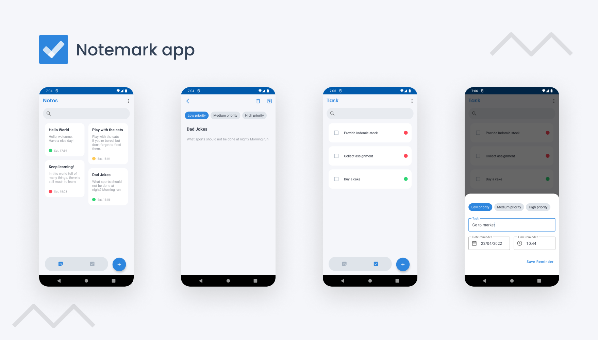

Notemarks is an application that functions to take notes, there is a priority label to categorize which priority is more important. In addition, this application also has a feature to add tasks reminder.

## Tech Stack
- MVVM (Model-View-ViewModel)
- Dagger Hilt
- Navigation Component
- Kotlin Flow + LiveData
- Room 
- WorkManager
- Data Binding
